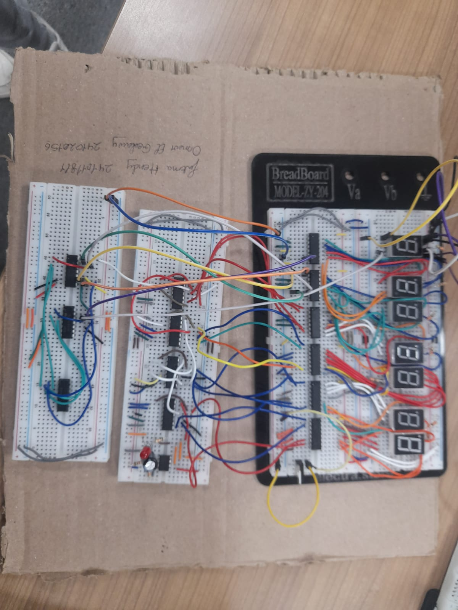
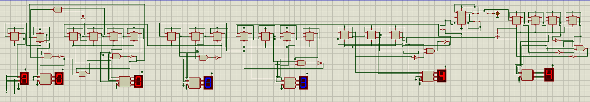

# 🕒 Digital Clock Using Digital Logic Components

## Project Overview

This project is a **digital clock (HH:MM:SS)** that resets every 12 hours and includes an **AM/PM extension**. It was implemented and simulated using **Proteus** with D Flip-Flops, decoders, and gates, and later built on a breadboard using **7490 Decade Counters**. 

This project was an excellent learning journey in digital electronics: using and/or/not gates, flip-flop behavior, reset logic, 7-segment displays, and simplification of logic circuits.

---

## 🧠 What I Learned

- Designing a clock system from scratch using digital logic
- Frequency generation using 555 timer
- Using D flip-flops to simulate T flip-flop behavior
- Binary counting and overflow detection
- Reset logic using combinational gates
- Decoding BCD to display on 7-segment
- Managing AM/PM toggling with clock resets
- Replacing flip-flop logic with decade counters for easier implementation

---

## ⚙️ Components Used

### 🧪 Proteus Simulation
- 555 Timer – 1
- 100μF Capacitor – 1
- 4.7kΩ Resistors – 2
- D Flip-Flops (7474) – 20 (10 ICs)
- 7447 Decoders – 7
- 7-Segment Displays – 7
- NOT Gates – 3 ICs
- AND Gates – 3 ICs

### 🧰 Breadboard Implementation
- Decade Counters (7490) – 7
- 555 Timer – 1
- 100μF Capacitor – 1
- 4.7kΩ Resistors – 2
- 7447 Decoders – 7
- 7-Segment Displays – 7
- NOT Gates – 3 ICs
- AND Gates – 3 ICs

---

## 🔄 Clock Logic Explanation

### 1. ⏱ Frequency Generation – 555 Timer

- Used in **astable mode** to generate a 1Hz pulse (1 pulse per second).
- Achieved using: 555 Timer + 100μF capacitor + 2× 4.7kΩ resistors.
- This pulse is fed into the clock input of the least significant flip-flop.

### 2. 🧮 Counting Logic with D Flip-Flops

Each decimal digit is implemented using flip-flops:
- **Units of Seconds/Minutes/Hours** – 4 flip-flops (0–9)
- **Tens of Seconds/Minutes** – 3 flip-flops (0–5)
- **Tens of Hours** – 1 flip-flop (0–1)

#### ⛓ T Flip-Flop from D Flip-Flop

A D flip-flop can mimic a T flip-flop by feeding `Q'` back into `D`:

T Flip-Flop Truth Table:
T | Q_next
0 | Q (No change)
1 | ~Q (Toggle)

D = T ⊕ Q → For T = 1 → D = ~Q → D = Q'

So we connected `Q'` to `D`, effectively toggling the output each clock pulse. The output of one flip-flop (e.g., `Q'`) can be used as the clock input to the next stage to divide the frequency.

---

### 3. ♻️ Reset Logic

- Each decimal digit resets after reaching its max (9 for units, 5 for tens).

#### 🧠 Reset Implementation:
- Use **AND gates** to detect a binary pattern (e.g., `1010` = 10).
- Use **NOT gates** to invert bits as needed.
- Feed the final signal to the **Reset** pins of the flip-flops (active low).

#### 🕓 Special Case – Reset After 12 Hours
- Detect when **Hours = 12 (Binary: Tens = 1, Units = 0010)**.
- Use an AND gate to combine these conditions.
- Reset all counters and toggle AM/PM flip-flop.

---

### 4. 🌓 AM/PM Extension

- A single D flip-flop toggled on every 12-hour cycle.
- Output connected to **segment C** of a 7-segment display:
  - Segment C lit = PM
  - Segment C off = AM

Only segment C is used (others tied to VCC/GND), effectively displaying a light for PM.

---

## 🔁 Alternative Implementation: Using 7490 Decade Counters

To simplify the circuit on the breadboard, we replaced flip-flop counters with 7490 ICs.

### Benefits:
- Built-in decade counting (0–9)
- Reset pins simplify logic
- Faster prototyping

### Custom Logic:
- For tens digits (max 5), use AND + NOT gates for binary 6 detection to reset.
- For hours reset at 12: use an AND gate combining:
  - Units = 2 (0010)
  - Tens = 1 (0001)

AM/PM toggle logic remains the same.

---

## 🖥 Circuit Designs

### ✅ Proteus
- Implemented with individual flip-flops, AND/NOT logic gates, and 7447 decoders.

### 🔌 Breadboard
- Used 7490 counters and simplified reset logic.
- Display logic preserved using 7447 + 7-segment.

## 📸 Screenshots

